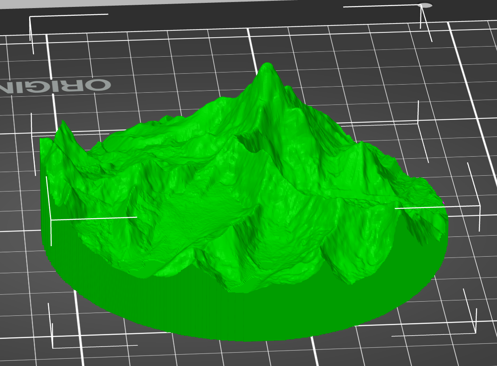

# Topogmesh: 3D printing the planet

## Overview
Topogmesh generates `.3mf` files suitable for 3D printing from terrain `.tif` files. It can also use `.geojson` files to define custom areas of terrain to include in the model.

## Installation
Topogmesh is available on PyPI and can be installed with pip:
```bash
pip install topogmesh
```

## How to use
You will need terrain `.tif` files for the region you want to model and a `.geojson` file to define the area to convert into a 3D printable mesh.

The example below shows generating a 3D model of Mount Everest:

```python
import topogmesh

everest_mesh = topogmesh.mesh_from_shape_file(
    shp_path='everest.geojson',
    tif_paths=['N27E086.tif', 'N28E086.tif', 'N29E086.tif'],
    base_height=5,
    scale=0.1
)

topogmesh.export_mesh_to_3mf(everest_mesh, 'everest.3mf')
```
